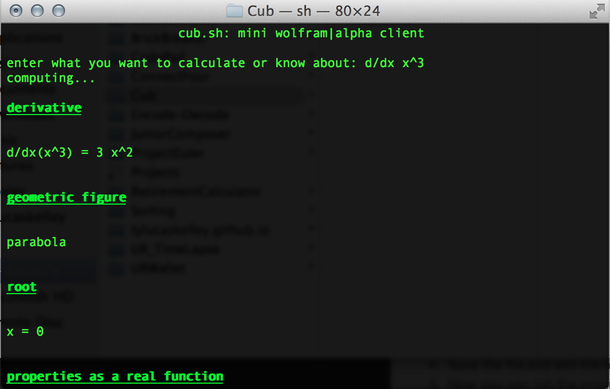
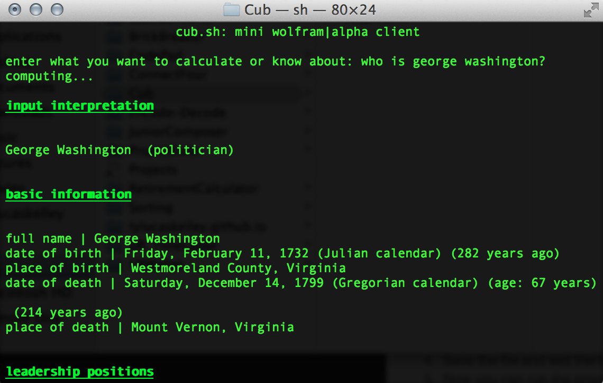
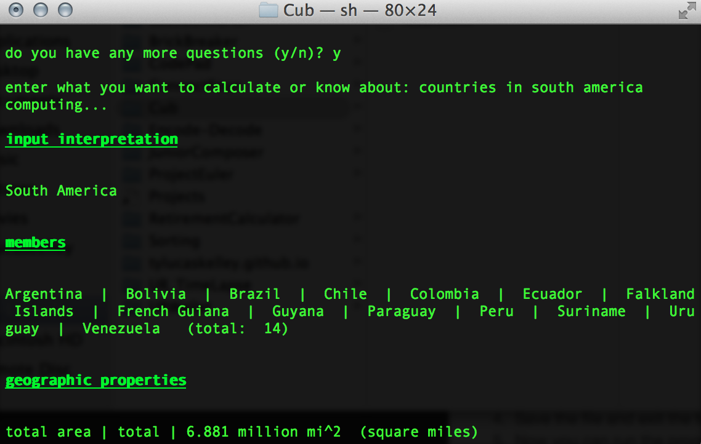

# Cub

*Make quick Wolfram Alpha queries from the terminal*

### What is it?

A command line interface to Wolfram Alpha that allows you to ask anything and get an answer. Works on Unix-based operating systems (Mac OS, Linux). 

### How does it work?

Cub uses the Wolfram Alpha API to make queries using curl, retrieve an XML document, and display a nicely formatted output using xmllint.

### Installation Guide

1. Download the zip from here, or simply clone the repository.
2. Make the `cub` file executable:

        $ chmod +x /path/to/cub

3. Extract the files and put them wherever you want, then do this:

		$ vi ~/.bashrc #or ~/.bash_profile, ~/.zshrc etc.
		
4. From inside vi:

		alias cub="./path/to/cub"

5. Save the file and exit, then restart your shell.
6. Now you can run the program by simply typing

		$ cub

7. But first, you need to get a Wolfram|Alpha ID. Go to [http://products.wolframalpha.com/api/](http://products.wolframalpha.com/api/), and get an AppID to get 2000 free queries per month.
8. Once you have your AppID, open up cub.sh and find this line near the top:

		id=$WOLFRAM_API_KEY #your appid here
        
8. Replace what I have there with your AppID, save the file, and you're all set!

### Screenshots

